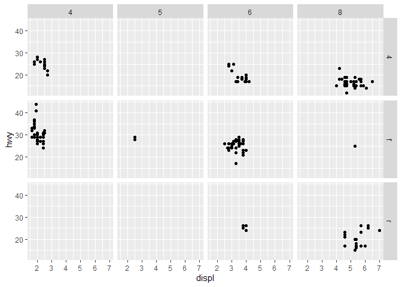

Data visualization
================
2021-07-23

Ejercicios del capítulo **3 Data visualisation** en [este
sitio](https://r4ds.had.co.nz/data-visualisation.html).

``` r
# Para instalar paquetes si no se tienen ya instalados, descomentar la siguiente línea
#install.packages("tidyverse")

# Carga del paquete
library(tidyverse)
```

    ## Warning: package 'tidyverse' was built under R version 4.0.5

    ## -- Attaching packages --------------------------------------- tidyverse 1.3.1 --

    ## v ggplot2 3.3.5     v purrr   0.3.4
    ## v tibble  3.1.2     v dplyr   1.0.7
    ## v tidyr   1.1.3     v stringr 1.4.0
    ## v readr   2.0.0     v forcats 0.5.1

    ## Warning: package 'ggplot2' was built under R version 4.0.5

    ## Warning: package 'tibble' was built under R version 4.0.5

    ## Warning: package 'tidyr' was built under R version 4.0.5

    ## Warning: package 'readr' was built under R version 4.0.5

    ## Warning: package 'dplyr' was built under R version 4.0.5

    ## Warning: package 'forcats' was built under R version 4.0.5

    ## -- Conflicts ------------------------------------------ tidyverse_conflicts() --
    ## x dplyr::filter() masks stats::filter()
    ## x dplyr::lag()    masks stats::lag()

El primer ejercicio usa un dataframe pre-cargado

``` r
mpg
```

    ## # A tibble: 234 x 11
    ##    manufacturer model    displ  year   cyl trans   drv     cty   hwy fl    class
    ##    <chr>        <chr>    <dbl> <int> <int> <chr>   <chr> <int> <int> <chr> <chr>
    ##  1 audi         a4         1.8  1999     4 auto(l~ f        18    29 p     comp~
    ##  2 audi         a4         1.8  1999     4 manual~ f        21    29 p     comp~
    ##  3 audi         a4         2    2008     4 manual~ f        20    31 p     comp~
    ##  4 audi         a4         2    2008     4 auto(a~ f        21    30 p     comp~
    ##  5 audi         a4         2.8  1999     6 auto(l~ f        16    26 p     comp~
    ##  6 audi         a4         2.8  1999     6 manual~ f        18    26 p     comp~
    ##  7 audi         a4         3.1  2008     6 auto(a~ f        18    27 p     comp~
    ##  8 audi         a4 quat~   1.8  1999     4 manual~ 4        18    26 p     comp~
    ##  9 audi         a4 quat~   1.8  1999     4 auto(l~ 4        16    25 p     comp~
    ## 10 audi         a4 quat~   2    2008     4 manual~ 4        20    28 p     comp~
    ## # ... with 224 more rows

Creación de un gráfico de dispersión

``` r
ggplot(data = mpg) +
  geom_point(mapping = aes(x = displ, y = hwy))
```

<!-- -->

Estas son las dimensiones del data frame. Primero filas y luego columnas

``` r
dim(mpg)
```

    ## [1] 234  11

Este es un scatterplot de las millas por galón, contra el número de
cilindros. Muestra una correlación negativa entre el número de cilindros
y la eficiencia del motor.

``` r
ggplot(data = mpg) +
  geom_point(mapping = aes(x = hwy, y = cyl))
```

<!-- -->

Este es un scatterplot del tipo de vehículo, contra el tipo de tracción.
No es muy útil porque ambas variables son categóricas.

``` r
ggplot(data = mpg) +
  geom_point(mapping = aes(x = class, y = drv))
```

<!-- -->

Se pueden variar los *aesthetics* de una gráfica cambiando las
propiedades dentro de *aes*. En este ejemplo se asigna al color de los
puntos.

``` r
ggplot(data = mpg) +
  geom_point(mapping = aes(x = displ, y = hwy, color = class))
```

<!-- -->

Se puede asignar la variable a el tamaño de los puntos

``` r
ggplot(data = mpg) +
  geom_point(mapping = aes(x = displ, y = hwy, size = class))
```

    ## Warning: Using size for a discrete variable is not advised.

<!-- -->

Se puede asignar a la transparencia de los puntos:

``` r
ggplot(data = mpg) +
  geom_point(mapping = aes(x = displ, y = hwy, alpha = class))
```

    ## Warning: Using alpha for a discrete variable is not advised.

<!-- -->

También se puede asignar a la forma de los puntos. Sin embargo, el
máximo de categorías para las formas es 6, por lo que en este ejemplo,
la última categoría no tiene forma.

``` r
ggplot(data = mpg) +
  geom_point(mapping = aes(x = displ, y = hwy, shape = class))
```

    ## Warning: The shape palette can deal with a maximum of 6 discrete values because
    ## more than 6 becomes difficult to discriminate; you have 7. Consider
    ## specifying shapes manually if you must have them.

    ## Warning: Removed 62 rows containing missing values (geom_point).

<!-- -->

Cuando se cambian los aesthetics dentro de aes, se hace usando una
variable como referencia. Pero si se quiere cambiar el color de toda la
gráfica, se puede hacer fuera del aes, dentro de las propiedades del
geom

``` r
ggplot(data = mpg) +
  geom_point(mapping = aes(x = displ, y = hwy), color = "blue")
```

<!-- -->

Para segmentar los gráficos en múltiples gráficos a partir de una
variable categórica, se utiliza la función de *facet\_wrap* como una
capa adicional a la gráfica. En este ejemplo, el primer argumento dentro
del facet es una *fórmula*, lo cual es un tipo de estructura de datos en
R.

``` r
ggplot(data = mpg) +
  geom_point(mapping = aes(x = displ, y = hwy)) +
  facet_wrap(~ class, nrow = 2)
```

<!-- -->

Se puede lograr un resultado similar con la función *facet\_grid*.
Incluso, se pueden ordenar las gráficas en función de una variable, de
modo que la misma posición de las gráficas es una especie de
scatterplot.

``` r
ggplot(data = mpg) +
  geom_point(mapping = aes(x = displ, y = hwy)) +
  facet_grid(drv ~ cyl)
```

<!-- -->
